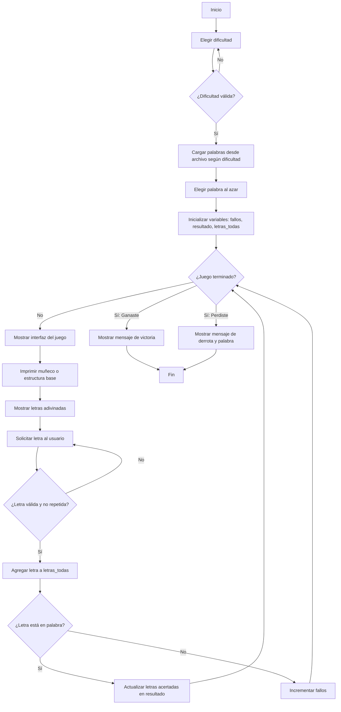

# Proyecto-Final (Ahorcado)
Codigo, Repo, Diagrama de flujo, autoria de: Carlos Samuel Guitierres Olejua y Miguel David Martinez Mendez (Grupo : Master chill)
# Resumen
Este es un juego del ahorcado con varias dificultades y archivos personalizados. Usa listas para:

-Elegir palabras.

-Verificar progreso.

-Dibujar al ahorcado paso a paso.

# Criterio Para Crear los .txt
Las dificultades Fácil, Media y Difícil solo incluyen palabras sin tildes; sus archivos .txt contienen términos correctamente escritos pero sin signos diacríticos. Por otro lado, las categorías temáticas como Pokémon, Naruto y la sección Con Tildes varían en la extensión de las palabras y en la dificultad. En la categoría Con Tildes es indispensable ingresar las vocales con su tilde correcta, ya que de lo contrario se considera un error. 

| **Categoría** | **Longitud de la palabra** |
| ------------- | -------------------------- |
| *Fácil*       | 3–5 letras                 |
| *Media*       | 6–8 letras                 |
| *Difícil*     | 9 o más letras             |

# 1) Importacion de Modulos
El módulo random se utiliza para que el programa escoja una palabra al azar, y el módulo os para realizar operaciones del sistema, como limpiar la pantalla o buscar archivos.

    import random
    import os

# 2) Funcion Para Cargar Archivos (Palabras)
Esta parte del código se encarga de abrir el archivo de palabras, cuyo nombre depende del nivel de dificultad y está guardado como un archivo .txt. Además de abrirlo, lee cada línea, elimina los espacios en blanco y convierte el texto a mayúsculas. Finalmente, devuelve una lista de palabras preparada para su correcto uso en el programa.

    def cargar_palabras(nombre_archivo):
        with open(nombre_archivo, "r", encoding="utf-8") as f:
            return [linea.strip().upper() for linea in f.readlines() if linea.strip()]

# 3) Configuraciones Por Dificultad
Se encarga de definir y relacionar las opciones de dificultad, las cuales están compuestas por el archivo asociado y el número máximo de intentos permitidos.

    config = {
        "facil": {"archivo": "facil.txt", "intentos_max": 8},
        "media": {"archivo": "media.txt", "intentos_max": 6},
        "dificil": {"archivo": "dificil.txt", "intentos_max": 4},
        "naruto": {"archivo": "naruto.txt", "intentos_max": 6},
        "pokemon": {"archivo": "pokemon.txt", "intentos_max": 6},
        "tildes": {"archivo": "tildes.txt", "intentos_max": 6},
        "animales":{"archivo": "animales.txt", "intentos_max": 6}
    }

# 4) Elección De Dificultad
Le solicita al usuario que elija un nivel de dificultad de entre las opciones ofrecidas. Una vez seleccionada, se verifica si la opción existe; de ser así, el programa continúa ejecutándose. En caso contrario, se le pedirá al usuario que ingrese una opción válida nuevamente, hasta que se cumpla la condición.

    while True:
        dificultad = input("Elige la dificultad (facil/media/dificil/naruto/pokemon/animales/tildes): ").lower()
        if dificultad in config:
            break
        print("Opción no válida. Intenta de nuevo.")

# 5) Ruta y Carga De Palabras
Esta parte del código se encarga de obtener la ruta del archivo actual mediante __file__ para conocer la ubicación del programa. Luego, combina esa ruta base con el nombre del archivo de palabras correspondiente al nivel de dificultad elegido. Finalmente, utiliza la función cargar_palabras para abrir el archivo, procesarlo y devolver la lista de palabras que se usarán en el juego.

    ruta_base = os.path.dirname(__file__)
    archivo_palabras = os.path.join(ruta_base, config[dificultad]["archivo"])
    palabras = cargar_palabras(archivo_palabras)

# 6) Seleccion De La Palabra Al Azar y Parametros
Gracias al import del inicio, el código puede seleccionar al azar una palabra del archivo .txt que ya fue abierto. Luego, convierte esa palabra en una lista de letras para poder compararlas una por una más adelante en el programa. Además, en esta parte se guarda el número máximo de intentos permitidos para el juego.

    palabra = list(random.choice(palabras))
    intentos_max = config[dificultad]["intentos_max"]

# 7) Interfaz Visual
Se define la interfaz visual del juego mediante dos listas: una contiene la estructura base de la horca vacía (estructura_base), que sirve como soporte, y la otra (ahorcado) almacena los dibujos de las distintas partes del muñeco. A medida que el jugador falla, se imprimen fragmentos del ahorcado para completar la figura.

    ahorcado = [
        "              !===============N",
        "              O               N",
        "            / | \\            N",
        "            \\ | /            N",
        "             / \\             N",
        "            /   \\            N",
        "           _\\   /_           N",
        "______________________________N"
    ]

    estructura_base = [
        "              !==============N",
        "                             N",
        "                             N",
        "                             N",
        "                             N",
        "                             N",
        "                             N",
        "_____________________________N"
    ]

# 8) Variables De Juego
Esta parte del código se encarga de guardar las letras que el usuario ya ha usado para evitar repeticiones, mediante la lista letras_todas. También inicializa el contador fallos, que registra cuántos errores ha cometido el jugador hasta el momento. Además, se crea la lista resultado, que muestra la palabra oculta reemplazada por guiones bajos _, representando cada letra que falta por adivinar.

    letras_todas = []
    fallos = 0
    resultado = ["_" for _ in palabra]

# 9) Informacion Basica Visual
Esta parte del código limpia la consola y muestra información básica del juego, como el título, los nombres de los creadores, el grupo de elaboración, el nivel de dificultad seleccionado, el número máximo de intentos permitidos y cuántos intentos le quedan al jugador.

    while True:
        os.system("cls" if os.name == "nt" else "clear")
        print("**********  Juego del ahorcado  **********")
        print("hecho por: Samuel Gutierres, Miguel Martinez")
        print("Estás jugando en modo:", dificultad.capitalize(), "- Te quedan", intentos_max - fallos, "intentos")
        print("Grupo: Master chill")

# 10) Sistema Del Dibujo Del Ahorcado
Va imprimiendo poco a poco las partes del muñeco —es decir, los elementos de la lista ahorcado— según los fallos que comete el jugador, y completa el resto con la estructura base de la horca

    for i in range(fallos):
        print(ahorcado[i])
    for i in range(len(estructura_base) - fallos):
        print(estructura_base[i + fallos])

# 11) Mostrar Progreso
Va reemplazando las letras que el jugador adivina correctamente, mostrándolas en pantalla y manteniendo los guiones bajos para las letras que aún faltan por descubrir. Muestra así una combinación de letras adivinadas y guiones.

        print("\n     ", end=" ")
    for letra in resultado:
        print(letra, end=" ")
    print("\n")

# 12) Gana o Pierde?
Comprueba si el jugador ha ganado o perdido: gana cuando la lista de letras que ha adivinado coincide completamente con la palabra a descubrir, y pierde cuando supera la cantidad de errores permitidos. Si el usuario adivinó toda la palabra, gana; si alcanza el límite de fallos, pierde.

        if resultado == palabra:
        print("***** HAS GANADO GG *****")
        break

    if fallos >= intentos_max:
        print("la palabra era: ", "".join(palabra))
        print("***** HAS PERDIDO POR BOT *****")
        break

# 13) Validación De La Letra Y Antierrores
Este es el filtro por el que pasa la letra que ingresa el usuario: primero se convierte a mayúscula, luego se verifica que sea solo una letra, se compara con la lista de letras ya ingresadas para evitar repeticiones y se valida que sea un carácter del alfabeto español. Si cumple todas las condiciones, se guarda en la lista de letras que el usuario ha dicho.

        while True:
        letra_usuario = input("Dime una letra: ").upper()
        if len(letra_usuario) != 1:
            print("Introduce solo una letra")
        elif letra_usuario in letras_todas:
            print("Esa letra ya la dijiste, cambia")
        elif letra_usuario not in "AÁBCDEÉFGHIÍJKLMNÑOÓPQRSTUÚVWXYZ":
            print("Introduce una letra válida")
        else:
            letras_todas.append(letra_usuario)
            break

# La Letra Esta o No?
Para finalizar, se ejecuta un bucle sencillo pero fundamental, que analiza si la letra ingresada por el usuario está en la lista de la palabra por adivinar. Si la letra se encuentra, se revela en todas las posiciones correspondientes; en caso contrario, se suma un fallo al contador.

        if letra_usuario in palabra:
        for i in range(len(palabra)):
            if palabra[i] == letra_usuario:
                resultado[i] = letra_usuario
    else:
        fallos += 1

# Diagrama De Flujo

# Apuntes
Es fundamental que los archivos .txt se encuentren en la misma carpeta que el archivo Python (Visual Studio Code). De lo contrario, el programa generará un error porque no encontrará la ruta correcta para cargar las palabras.

# Codigo Completo
    import random
    import os

    # Función para leer palabras de archivo
    def cargar_palabras(nombre_archivo):
        with open(nombre_archivo, "r", encoding="utf-8") as f:
            return [linea.strip().upper() for linea in f.readlines() if linea.strip()]

    # Configuraciones por dificultad
    config = {
        "facil": {"archivo": "facil.txt", "intentos_max": 8},
        "media": {"archivo": "media.txt", "intentos_max": 6},
        "dificil": {"archivo": "dificil.txt", "intentos_max": 4},
        "naruto": {"archivo": "naruto.txt", "intentos_max": 6},
        "pokemon": {"archivo": "pokemon.txt", "intentos_max": 6},
        "tildes": {"archivo": "tildes.txt", "intentos_max": 6},
        "animales":{"archivo": "animales.txt", "intentos_max": 6}
    }

    # Elegir dificultad
    while True:
        dificultad = input("Elige la dificultad (facil/media/dificil/naruto/pokemon/animales/tildes): ").lower()
        if dificultad in config:
            break
        print("Opción no válida. Intenta de nuevo.")
    
    #  Construir ruta completa para buscar siempre en la carpeta correcta
    ruta_base = os.path.dirname(__file__)
    archivo_palabras = os.path.join(ruta_base, config[dificultad]["archivo"])
    palabras = cargar_palabras(archivo_palabras)

    palabra = list(random.choice(palabras))
    intentos_max = config[dificultad]["intentos_max"]

    # Muñeco y base 
    ahorcado = [
        "              !===============N",
        "              O               N",
        "            / | \\            N",
        "            \\ | /            N",
        "             / \\             N",
        "            /   \\            N",
        "           _\\   /_           N",
        "______________________________N"
    ]

    estructura_base = [
        "              !==============N",
        "                             N",
        "                             N",
        "                             N",
        "                             N",
        "                             N",
        "                             N",
        "_____________________________N"
    ]

    # Inicialización del juego
    letras_todas = []
    fallos = 0
    resultado = ["_" for _ in palabra]

    # Bucle principal
    while True:
        os.system("cls" if os.name == "nt" else "clear")
        print("**********  Juego del ahorcado  **********")
        print("hecho por: Samuel Gutierres, Miguel Martinez")
        print("Estás jugando en modo:", dificultad.capitalize(), "- Te quedan", intentos_max - fallos, "intentos")
        print("Grupo: Master chill")

    for i in range(fallos):
        print(ahorcado[i])
    for i in range(len(estructura_base) - fallos):
        print(estructura_base[i + fallos])

    print("\n     ", end=" ")
    for letra in resultado:
        print(letra, end=" ")
    print("\n")

    if resultado == palabra:
        print("***** HAS GANADO GG *****")
        break

    if fallos >= intentos_max:
        print("la palabra era: ", "".join(palabra))
        print("***** HAS PERDIDO POR BOT *****")
        break

    while True:
        letra_usuario = input("Dime una letra: ").upper()
        if len(letra_usuario) != 1:
            print("Introduce solo una letra")
        elif letra_usuario in letras_todas:
            print("Esa letra ya la dijiste, cambia")
        elif letra_usuario not in "AÁBCDEÉFGHIÍJKLMNÑOÓPQRSTUÚVWXYZ":
            print("Introduce una letra válida")
        else:
            letras_todas.append(letra_usuario)
            break

    if letra_usuario in palabra:
        for i in range(len(palabra)):
            if palabra[i] == letra_usuario:
                resultado[i] = letra_usuario
    else:
        fallos += 1

